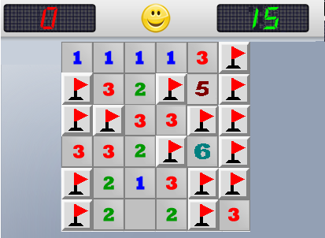
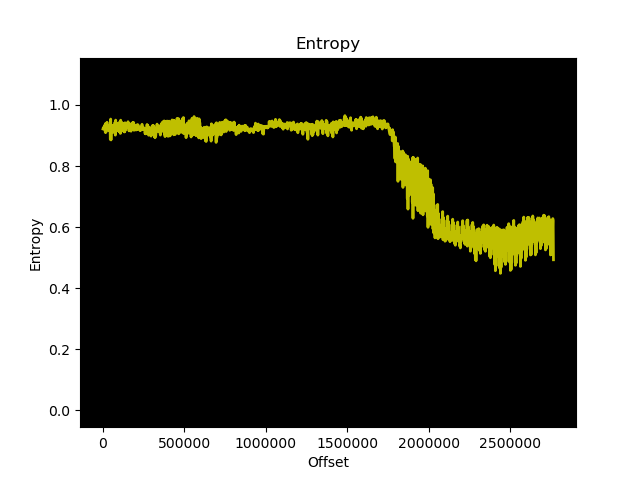
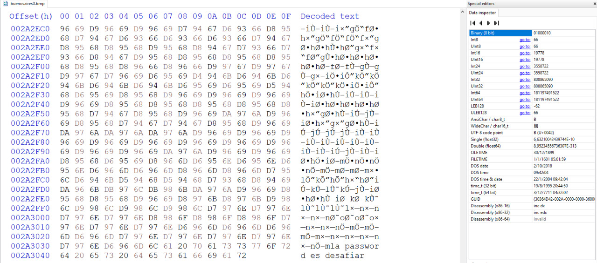

# Estegoanálisis

## Archivos de Prueba

Se cuenta con 4 archivos de prueba:

1. buenosaires.bmp
2. buenosaires0.bmp
3. topgun0.bmp
4. frozen.bmp

## Condiciones Iniciales

Se conoce que los 4 archivos cuentan con algún tipo de información oculta.
Además se sabe que hay un archivo utilizando LSB1, otro LSB4, otro LSBI y el
último no utiliza una estenografía de tipo LSB.

## Análisis

Para cada archivo se intenta abrirlo con todos los métodos de estenografía que
no se hayan utilizado exitosamente todavía. Primero se prueba levantar todos
los archivos sin ningún tipo de encripción.

### buenosaires.bmp

**LSB1**

```sh
./stegobmp --extract -p grupo20/buenosaires.bmp -o extracted_buenosaires --steg=LSB1
```

Utilizando LSB1 no se tuvo éxito.

**LSB4**

```sh
./stegobmp --extract -p grupo20/buenosaires.bmp -o extracted_buenosaires --steg=LSB4
```

Utilizando LSB4 sí se tuvo éxito y se encontró la siguiente imagen escondida:

<center></center>

### buenosaires0.bmp

**LSB1**

```sh
./stegobmp --extract -p grupo20/buenosaires0.bmp -o extracted_buenosaires0 --steg=LSB1
```

Utilizando LSB1 no se tuvo éxito.

**LSBI**

```sh
./stegobmp --extract -p grupo20/buenosaires0.bmp -o extracted_buenosaires0 --steg=LSBI
```

Utilizando LSBI no se tuvo éxito.

Es posible que el archivo se encuentre encriptado, por lo que se continua con
otro archivo.

### topgun0.bmp

**LSB1**

```sh
./stegobmp --extract -p grupo20/topgun0.bmp -o extracted_topgun0 --steg=LSB1
```

Utilizando LSB1 no se tuvo éxito.

**LSBI**

```sh
./stegobmp --extract -p grupo20/topgun0.bmp -o extracted_topgun0 --steg=LSBI
```

Utilizando LSBI se obtuvo un archivo `extracted_topgun0.pdf` con el mensaje:

**_al .png cambiarle la extension por .zip y descomprimir_**

Parecería ser que se refiere al archivo que se obtuvo a partir de la imagen
`buenosaires.bmp`

### extracted_buenosaires0.png

Siguiendo las instrucciones del pdf anterior, se ejecuta lo siguiente:

```sh
cp extracted_buenosaires.png bsas.zip && unzip bsas.zip
```

y de esta manera se obtiene un archivo `sol20.txt` que dice lo siguiente:

<center><em>
cada mina es un 1.
cada fila forma una letra.
Los ascii de las letras empiezan todos en 01.
Asi encontraras el algoritmo que tiene clave de 128 bits y el modo
La password esta en otro archivo
Con algoritmo, modo y password hay un .wmv encriptado y oculto.
</em></center>
<br/>
<center></center>

|     |     |     |     |     |     |     |     | ASCII |
| --- | --- | --- | --- | --- | --- | --- | --- | ----- |
| 0   | 1   | 0   | 0   | 0   | 0   | 0   | 1   | A     |
| 0   | 1   | 1   | 0   | 0   | 1   | 0   | 1   | E     |
| 0   | 1   | 1   | 1   | 0   | 0   | 1   | 1   | S     |
| 0   | 1   | 0   | 0   | 0   | 1   | 0   | 1   | E     |
| 0   | 1   | 1   | 0   | 0   | 0   | 1   | 1   | C     |
| 0   | 1   | 1   | 0   | 0   | 0   | 1   | 0   | B     |

Siguiendo las instrucciones obtenemos que hay un archivo que está encriptado con
AES128 y modo ECB. Además nos dicen que este archivo es un video (wmv).

Teniendo en cuenta que el archivo frozen.bmp es **significativamente** más
grande que los demás, se sospecha que este es el archivo encriptado que
contiene el video. Por lo tanto es probable que el archivo `buenosaires0.bmp`
sea el que no contiene un mensaje utilizando un método LSB y por lo tanto sería
el que contiene la contraseña como indica `sol20.txt`.

### buenosaires0.bmp (devuelta)

Para investigar que podría estar pasando en este archivo se utilizó `binwalk`
para ver la entropía del archivo y generar un gráfico correspondiente:

```sh
binwalk -E -J grupo20/buenosaires0.bmp
```

Con esto obtenemos el siguiente gráfico:

<center></center>

Parecería indicar que puede llegar a haber información al final del archivo.

Abriéndolo con un hexeditor se encuentra lo siguiente:

<center></center>

Se puede ver que al final del archivo dice:

<center><em>la password es desafiar</em></center>
<br>

Teniendo en cuenta esto usamos las configuraciones obtenidas previamente para
extraer el archivo de `frozen.bmp`.

### frozen.bmp

Como ya se encontró un archivo con LSB4 y otro con LSBI este debería ser LSB1,
encriptado utilizando AES128 en modo ECB con contraseña: desafiar

Corriendo lo siguiente:

```sh
./stegobmp --extract -p grupo20/frozen.bmp -o extracted_frozen \
--steg=LSB1 -a=AES12 -m=ECB --pass=desafiar
```

Obtenemos el archivo `extracted_frozen.wmv` que es un video de 53s de una
escena de la película Wanted (2008). 
